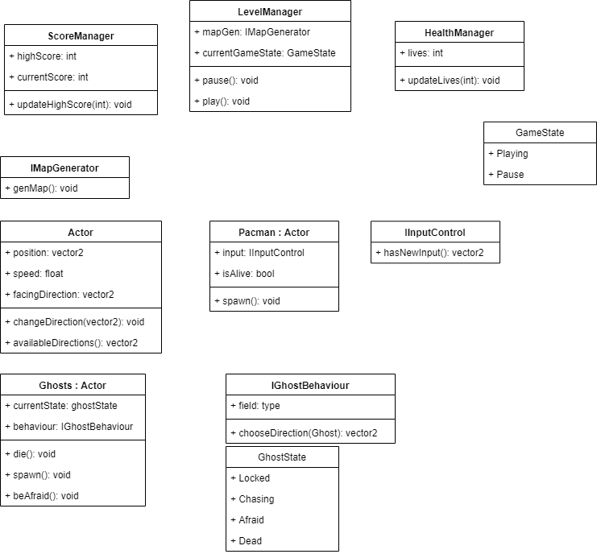

# PacmanR

Você pode jogar na web [aqui](https://redashes.itch.io/pacmanr)
Ou baixar o .apk [aqui](https://drive.google.com/open?id=1E7Z-IQYOXLYQqF0f7UiMoaKrdP7yOCVV)

A arquitetura inicial do projeto:

Claro, algumas coisas mudaram, mas o principal continua bem parecido.

As principais classes são:

 - LevelManager
 - MapGenerator
 - Grid
 - Node
 - Actors
 - Ghosts
 - Pacman

# LevelManager

Gerencia todo o escopo global do game,  ele pode pausar, resumir, resetar o game, ou resetar a cena, quando a cena é criada, o level manager inicializa o **MapGenerator**.

# MapGenerator

Essa classe é responsável pelo mapa, ela lê as informações armazenadas no JSON e cria um _array2D_ de _ints_ que serão transformados em **ItemTypes** e instanciados logo depois, essa classe também volta a um _array2D_ de _Vertice2_ que será utilizada na navegação dos **Actors**

## Item Types

| Int | Type | Descrição|
| ------ | ------ | ------ |
| 0 | Empty | Espaço vazio |
| 1 | Wall |Paredes, não é possível atravessar |
| 2 | Point | Pequenos pontos que o pacman come |
| 3 | PlayerPos| Posição inicial do pacman |
| 4 | Teleport | Bloco que teleporta **Actors** de um ponto a  outro |
| 5 | Blinky | Posição inicial do fantasma vermelho |
| 6 | PowerDot | Grande ponto que permite o pacman comer fantasmas|
| 7 | Pinky | Posição inicial do fantasma rosa |
| 8 | Inky | Posição inicial do fantasma cyano |
| 9 | ThinWall| Pequena parede que só fantasmas podem atravessar |
| 10 | Clyde | Posição inicial do fantasma laranja |
| 11 | FruitSpawn | Posição onde aparecerá a fruta bônus no meio do level|

# Grid

Cria e armazena os **Nodes**

# Node
É a parte básica da grid, com ele os **Actors** vão conseguir se movimentar, checar "colisões" e fantasmas tomarão decisões em nodes que tenham uma intersecção

# Actors
É a base principal de todos personagens do jogo (**pacman** e **fantasmas**), essa classe cuida da movimentação de forma geral do jogo.

# Ghosts
Essa classe possui uma maquina de estado para os fantasmas, e de acordo com cada estado, um fantasma pode realizar uma ação diferente, todos os comportamentos herdam dessa classe e sobrescrevem a função **ChasingIntersection** que é chamada quando o fantasma está no estado de perseguir o player e está em uma intersecção.

As classes que herdam de Ghosts (**Blinky**, **Clyde**, **Inky** e **Pynky**) tem um comportamento único quando estão perseguindo o player, porém todos outros estados são iguais.

# Pacman
Essa classe é responsável pelas ações do pacman, ela ouve os inputs do usuário e muda de direção, e também consome pontos, bônus e fantasmas.